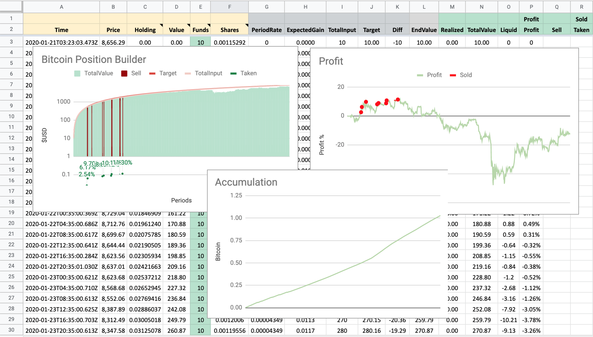
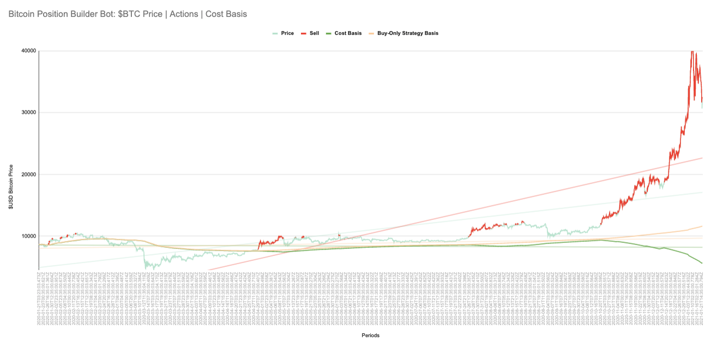

# Coinbase Position Builder Bot

> Position Building Bot for Accumulating Bitcoin (or other currencies) via Coinbase Pro, while taking advantage of pumps.

We don't need to look at charts. The trendlines and price predictions don't matter. All that matters is your current cost-basis and investment. Are you in profit? Is the price a dip relative to your current holdings? These questions are easy to answer without having to be an oracle. You just have to keep track of your investments, calculate where you fall at the current moment, and automate an action. That's what this project does!

This bot will make a market taker action of the configured funding level at the configured interval. If the current holdings that the bot has accumulated is at a profit point higher than a target APY (and the action volume will keep the holdings at a value higher than the APY), then it will make a sell action, else it makes a buy action.

Here is a view of my first 1 BTC purchased via this method (in a Google Sheet for charting):


And here is a view of the bot running for a full year (in a Google Sheet for charting):


After running this engine for a bit, you can copy the data in your local log file (e.g. `./data/history.BTC-USD.tsv`) and paste it into the spreadsheet template by [creating a copy of this Google Docs Sheet](https://docs.google.com/spreadsheets/d/1DPo9amEx6RAr33Nnaq27J59AA7XiO90Q2bBP9rq2Tiw/edit?usp=sharing). This template can be saved locally and periodically updated or saved to Google Docs or some other service for backup.

## WARNING
This tool is built for my own personal use--and while I have published it publicly for others to use/enjoy, please beware that usage of this tool is at your own risk. I have not accounted for all edge cases as I watch and tune this code as an experiment in-progress.

## Getting Started

This project is written in Node.js. You will need to have Node installed on the machine that will run this app. If you don't have it, I recommend using [nvm](https://github.com/nvm-sh/nvm) to install Node.js.

This is all much easier on a Linux/Mac environment with a shell. I have not tried installing and running this on Windows.

1. Install [Node.js](https://nodejs.org/en/) or via NVM
2. Optional: Install a good text editor (like https://code.visualstudio.com/)
  - After install, F1 and type "shell command"
  - install shell extension so you can type `code .` in a terminal to open the project up in the editor
3. git clone this project (via terminal) -- or download zip file and unzip
```
git clone https://github.com/jasonedison/coinbase_position_builder_bot.git
cd coinbase_position_builder_bot
```
4. Install dependencies and PM2 (process manager)
```
npm run setup
```
5. Create a Coinbase Pro account (if you don't already have one)
6. Connect a bank account and transfer in some money (you will need to make sure you keep your USD balance fed with enough runway to keep buying during a bear market)
7. Create API Key, pass, and secret on Coinbase Pro: https://pro.coinbase.com/profile/api
  - must have `view`+`trade` permissions
  - there is no need to allow `transfers` (this script does not move money to/from your bank account)
  - recommended to limit the API keys to IP address whitelists
8. Add the key, pass, and secret to your environment via environmental variables, or add them to the `./api.key.js` file (BUT DO NOT COMMIT THIS FILE TO GIT OR PUBLISH ONLINE)
9. Test all the configs in dry run mode at 1 minute intervals:
```
pm2 start run.dry.all.minute.config.js && pm2 logs
```
10. Kill it
```
pm2 kill
```
11. Now copy one of the sample configs (e.g. run.default.btcusd.config.js)
```
cp run.default.btcusd.config.js run.config.js
```
12. Edit your new `run.config.js` to have the APY and VOLUME values you want by editing `CPBB_APY` and `CPBB_VOL`, respectively.
13. Adjust the run time interval to suit your preferences. You can use https://crontab.guru/#5_*/12_*_*_* to help turn your desired frequency into the crontab syntax that goes in `CPBB_FREQ`
14. Now run it for real
```
pm2 start run.config.js && pm2 logs
```
15. Setup PM2 to save this as a startup task: `pm2 startup`
16. save current configuration `pm2 save`

[PM2 Docs](https://pm2.keymetrics.io/docs/usage/pm2-doc-single-page/)
[PM2 Startup Docs] More info on PM2 startup: https://pm2.keymetrics.io/docs/usage/startup/

## Upgrading The Project Version

If you downloaded the project via a `git clone`, upgrading is super easy via `git pull --rebase --autostash`, you should be all set. PM2 watches the directory and will restart the processes with the latest code. All done.

If you downloaded the project via a zip file, it's a bit more complicated.
1. Download the latest release zip file: https://github.com/jasonedison/coinbase_position_builder_bot/releases
2. unzip
3. run `npm i` in the folder
4. copy your `./data/history*` files from your old project directory
5. copy your `./data/maker.orders*` files from your old project directory (if they exist, version > 2.1.0)
6. copy your custom run.*.config.js file (with your config setup)
7. Ensure that your keys are in your environment by doing `echo $CPBB_APIKEY` -- this should be the value you set (if it returns nothing, your environmental variables are not set right). If you had set your keys in api.keys.js (not recommended but useful if you don't know how to set environmental variables), make sure you copied that file from your old project
8. run `pm2 kill` to stop all running pm2 processes
9. run `pm2 start [YOUR_CONFIG_NAME].config.js` (e.g. `pm2 start run.mine.config.js`)

## Changing Config Settings
If you edit your *.config.js file with new values, you will have to kill pm2 and start your app from the config fresh. pm2 restart and reload does not read new environmental variables.
1. Edit your config file
2. run `pm2 kill` to stop all running pm2 processes
3. run `pm2 start [YOUR_CONFIG_NAME].config.js` (e.g. `pm2 start run.mine.config.js`)


### Default Configuration
Note: the default settings will take a $10 action every 12 hours on BTCUSD. If Bitcoin sustains a bear market for a full year, this would amount to spending $20/day = $140/week = $7,300/year on Bitcoin (always accumulating). If the price fluctuates enough to cross the profitability threshold (default 15% APY), it may sell upward and sustain itself with a floating balance for a while.

The defaults can be overridden with environmental variables (or update in the run.*.config.js files with pm2):
```
export CPBB_APY=15 # 15% APY (sell above this gain)
export CPBB_VOL=10 # take $10 actions at configured frequency
export CPBB_FREQ="5 */8 * * *" # crontab description of task frequency (every 8 hours, on the 33rd minute) - https://crontab.guru/every-8-hours
export CPBB_TICKER=BTC
export CPBB_CURRENCY=USD # this is the account we will take buy/sell actions on (money will move in and out of this, exchanged for CPBB_TICKER)
```

### Rebuy Configuration
Since 2.1.0, we have a rebuy feature that will set limit orders to rebuy some of the sold asset if it drops to a specified target % drop point between checking periods.

There are two sample configs that illustrate how this can be configured:
- `run.btcusd.limit_only.config.js`
- `run.btcusd.rebuy.config.js`

```
// should the engine only create and manage the limit orders and not make normal accumulation trades
// useful for testing this feature
// or for running a bot that only wants to accumulate an asset via dips
CPBB_REBUY_ONLY: true,
// maximum dollar value consumed by limit order placements
CPBB_REBUY_MAX: 50,
// NOTE: as of 2021-02-22, Coinbase has the following minimum order sizes:
// BTC minimum order is .0001 ($5 at $50K)
// ETH minimum order is .001 ($5 at $5K)
// LTC minimum order is .01 ($5 at $500)
// DASH minimum order is .01 ($5 at $500)
// etc: try to make absurdly small limit orders via coinbase UI to get an error with the limit
// these could change in the future and allow you to make smaller size rebuy trades
// rebuy logic will place up to  orders at this size until CPBB_REBUY_MAX is reached
CPBB_REBUY_SIZE: ".0001,.0001,.0002,.0002,.0003,.0003,.0004,.0004,.0005,.0005",
// rebuy at these percentage drop targets (-1%, -2%, etc)
// note: you have to define at least the number of points in CPBB_REBUY_SIZE
CPBB_REBUY_AT: "-.01,-2,-4,-5,-8,-10,-12,-25,-50,-80",
```

### Volume and Frequency
Unfortunately, the Coinbase Pro API will only allow market taker orders of `$10` or more. So my original idea of buying $1 or $2 worth every hour (or even more frequently) went bust--unless you want to make a $10/hour order, which adds up fast if you are in a continuous recession (always buying mode).

$10/hour = $240/day = $1680/week = $87,600/year max buy.

If you've got an extra $87K/year to build a position into Bitcoin, `more power to you`. But otherwise you might be better off with some of these options:

- $10/(2 hours) = $120/day = $840/week = $43,800/year
  - `CPBB_FREQ='0 */2 * * *' node .`
- $10/(3 hours) = $80/day = $560/week = $29,120/year
  - `CPBB_FREQ='0 */3 * * *' node .`
- $10/(4 hours) = $60/day = $420/week = $21,900/year
  - `CPBB_FREQ='0 */4 * * *' node .`
- $10/(6 hours) = $40/day = $280/week = $14,600/year
  - `CPBB_FREQ='0 */6 * * *' node .`
- `DEFAULT` $10/(8 hours) = $30/day = $210/week = $10,950/year
  - `CPBB_FREQ='0 */8 * * *' node .`
- $10/(12 hours) = $20/day = $140/week = $7,300/year
  - `CPBB_FREQ='0 */12 * * *' node .`
- $10/day = $70/week = $3,650/year (runs at 1am every day)
  - `CPBB_FREQ='0 1 * * *' node .`
- etc...

If you want more crontab frequency options, you can construct your own via https://crontab.guru/

Additionally, could alter the dollar amount and act with `$15` twice a day (for example) like so:
```
CPBB_VOL=15 CPBB_FREQ='0 */12 * * *' node .
```

## Test

There are two ways to test:

### 1. Using the Coinbase Sandbox API

The first option is not great for testing strategies because it uses the sandbox API network which does not support many trading pairs and has fake liquidity and transactions. This path exists, only for testing code updates (to make sure the app still works after big code refactors). This option also requires a different API key, and is probably more headache than it's worth for regular testing.

> The second option is the recommended path for users

1. Create a Sandbox API account and API Keyset here: https://public.sandbox.pro.coinbase.com/profile/api
2. You will also need to fake transfer USD from Coinbase into the Sandbox

Then run the app against the Sandbox API
```
export CPBB_APIPASS="API Password"
export CPBB_APIKEY="SANDBOX API KEY"
export CPBB_APISEC="SANDBOX API SECRET"
CPBB_TEST=1 node .
```

### 2. Using CPBB_DRY_RUN feature

The real coinbase API can also be run in a "dry run" mode, which will calculate and record transactions into a special dry run history log as if actions were taken, even though no buy/sell orders are made against the API.

1. Edit the `./api.keys.js` file to have your APIPASS, APIKEY, and APISEC (or add them as environmental variables)
2. start pm2
```
pm2 start run.dry.all.minute.config.js
```
3. observe the logs: `pm2 logs`
4. Let it run for a few minutes
5. kill it: `pm2 stop run.dry.all.minute.config.js`
6. look at the log files: `./data/history.BTC-USD.dryrun.tsv` and `./data/history.LTC-BTC.dryrun.tsv`, etc

## History / Logs
This app is built to be entirely self-contained. There is no database or 3rd party (aside from Coinbase as the market source). Activity is logged to a tsv file in the local `./data` directory on disk. 

Here is an example log from my first tests:
```
Time	Price	Holding	Value	Funds	Shares	PeriodRate	ExpectedGain	TotalInput	Target	Diff	EndValue	Realized	TotalValue	Liquid	Profit
2020-01-21T03:23:03.473Z	8656.29	0	0	10	0.00115292	0	0	10	10	-10	10	0	10	0	0
2020-01-21T03:24:03.473Z	8655.89	0.00115292	9.98	10	0.00115297	0.00000344	0	20	20	-10	19.98	0	19.98	-0.02	-0.10%
2020-01-21T03:25:03.473Z	8645.22	0.00230589	19.93	10	0.00115378	0.00000344	0	30	30	-10	29.93	0	29.93	-0.07	-0.22%
2020-01-21T03:26:02.704Z	8646.62	0.00345967	29.91	10	0.00115421	0.00000344	0	40	40	-10.02	39.91	0	39.91	-0.09	-0.12%
2020-01-21T03:27:02.162Z	8646.63	0.00461388	39.89	10	0.00115421	0.00000344	0	50	50	-10.04	49.89	0	49.89	-0.11	-0.15%
2020-01-21T03:28:02.535Z	8645.95	0.00576809	49.87	10	0.0011543	0.00000344	0	60	60	-10.07	59.87	0	59.87	-0.13	-0.16%
2020-01-21T03:29:01.562Z	8645.5	0.00692239	59.85	10	0.00115436	0.00000344	0	70	70	-10.09	69.85	0	69.85	-0.15	-0.18%
2020-01-21T03:30:02.972Z	8646.95	0.00807675	69.84	10	0.00115416	0.00000344	0	80	80	-10.1	79.84	0	79.84	-0.16	-0.17%
2020-01-21T03:31:03.212Z	8649.49	0.00923091	79.84	10	0.00115399	0.00000344	0	90	90	-10.1	89.84	0	89.84	-0.16	-0.15%
2020-01-21T03:32:02.504Z	8646.19	0.0103849	89.79	10	0.00115404	0.00000344	0	100	100	-10.15	99.79	0	99.79	-0.21	-0.18%
2020-01-21T03:33:02.693Z	8651.56	0.01153894	99.83	10	0.00115355	0.00000344	0	110	110	-10.12	109.83	0	109.83	-0.17	-0.13%
2020-01-21T04:35:02.496Z	8670	0.01269249	110.04	10	0.0011511	0.00001123	0	120	120	-9.96	120.04	0	120.04	0.04	0.04%
```

# Projecting Future Gains

We can't predict the future, but we can take historical data and backtest it
as if it will go that way again. The easiest way to do this from our existing history
is to model the price reversing course from the last log back to the start of our history.

There is another provided tool for taking an existing history file and running a projection based on that history repeating in reverse from the last log.

It can be used to examine what it might look like if we alter the volume or APY target in th event that the price reverses in the same pattern as our current log of transactions.

  Note: this model runs using the existing engine log with the price/timestamps listed in the history. So it will model those prices and intervals in reverse. You will need to have run this engine for some amount of time prior to running the future projection tool in order to project from your particular history:

```
CPBB_VOL=20 CPBB_APY=20 node project.forward.js
```

This will examine your current history file (e.g. `./data/history.BTC-USD.tsv`), reverse the data, and run it as projected future events. Then it will save the result in a corresponding projection file (e.g. `./data/history.BTC-USD.projection.tsv`).


# Scripting Tools

## Tax Calculator
NOTE: I am not an accountant. I am not a fiduciary. You are responsible for the accuracy of your own tax reporting and usage of this tool is not guaranteed to give you accurate results. I use it. It's for me. If you want to use it, you are responsible for reviewing the code and making sure it is accurate for your accounting needs/purposes.

### Calculate Short-term and Long-term and Capital Gains for a Calendar Year
```
CPBB_TICKER=BTC CPBB_CURRENCY=USD CPBB_YEAR=2020 node tax_fifo.js
```

## APY Adjuster
If you want to change your APY and back-edit all your history so your Target is adjusted to be that APY consistently for your whole history (this will compound). You can run like so:
```
# updates the BTC-USD history with 150% APY (creates a new ./data/history.BTC-USD.fixed.apy.tsv that will need to be reviewed and copied into your history.BTC-USD.tsv)
CPBB_TICKER=BTC CPBB_APY=150 node adjust.apy.js
# after copying into ./data/history.BTC-USD.tsv
pm2 reload all
```

## Adding Missing Records
I have noticed that in extreme situations, the Coinbase API will be so overloaded that the API will fail to complete an order and timeout. However, the order does complete. When I notice this, I can see in Coinbase that the order went through and get the price and shares traded--but the engine is still running without that info!

> NOTE: I believe we have addressed this in retry logic. If you see this happen, please file an issue.

To correct this, I've added a manual log entry tool. In order to use this, you will need to load your keys as env vars and then execute like the following:

```
# node addLog.js $TICKER $CURRENCY $VOLUME $APY $DATEISO $PRICE $SHARES
node addLog.js BTC USD 50 20 2020-11-26T16:35:00.706Z 16915.52 0.00295586
```

# Disclaimer
This software is provided "as is", without warranty of any kind, express or implied, including but not limited to the warranties of merchantability, fitness for a particular purpose and non-infringement. In no event shall the authors, copyright holders, or Coinbase Inc. be liable for any claim, damages or other liability, whether in an action of contract, tort or otherwise, arising from, out of or in connection with the software or the use or other dealings in the software.

# Who Am I?

I'm a recent NYU grad and Microsoft Intern. I like to play with code as a way of exploring and proving economic theories.

I am not a financial advisor but you can find my occasional takes on twitter: https://twitter.com/cryptecon
